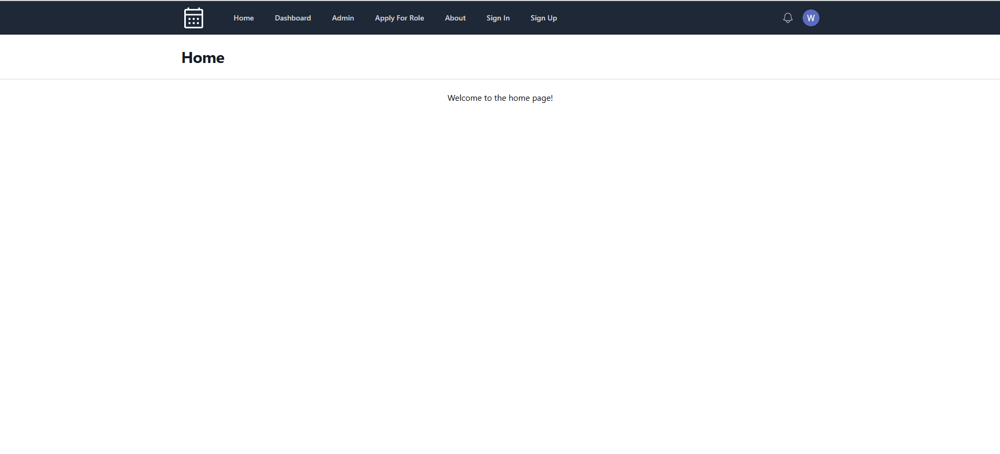

# Separate Setting Manager

## Final Project for Master of Science in Information Technology at UNCC

## Table of Contents

[Project Summary](#project-summary)

[Problem Statement](#problem-statement)

[The Project](#the-project)

[The Stack](#the-stack)

[Components of the Project:](#components-of-the-project)

[Domain](#domain)

[Repositories](#repositories)

[Services](#services)

[Handlers:](#handlers)

[Reflection](#reflection)

[Knowledge and Skills Acquired](#knowledge-and-skills-acquired)

[Related Courses](#related-courses)

[Barriers and Challenges](#barriers-and-challenges)

Separate Setting Manager: A Full Stack Web Application

Submitted November 2024

University of North Carolina at Charlotte (UNCC)

Culminating Experience | Project Report

Masters in Information Technology program

Author: Will Lapinel

## Project Summary

Separate Setting Manager is a prototype of a full-stack web application that provides a room reservation service for teachers with students who have a “small group setting” test accommodation in their Individual Education Plan (IEP).  I had built a previous version of this project using NextJS in December 2023 and January 2024\.  I began this version of the project in the summer 2024, and while my work slowed in late August due to my beginning three challenging classes in the Fall semester, fortunately it was largely complete by that time. This was part of an ongoing personal project, not part of any class assignment, internship or work-related assignment.  I chose this project for several reasons:

* to solve a real-world problem at my workplace

* to gain experience in production-quality, full-stack web development

* to learn various technologies, including the Go programming language and HTMX

* to assess the guiding principles for web development advocated in the book Hypermedia Systems and compare the experience of developing a Hypermedia System to that of a Single-Page Application.

### Problem Statement

I am employed as a Python teacher at Phillip O. Berry Academy of Technology, part of Charlotte-Mecklenburg Schools (CMS).  Many students in CMS, including some of my own, have special testing accommodations that teachers are required to provide for any formal exam.  Every course typically has 3 to 4 unit exams each quarter in addition to midterm and final exams, and every teacher typically has several, perhaps 1 to 2 per section.  This amounts to a significant number of accommodations being provided each week.  Some schools are very short on space, and teachers often experience significant challenges in finding both a proctor and a room for these students on test day.  Some schools have designated rooms and an effective schoolwide registration system, but in such cases, forms must be completed for each event, and an administrator must be assigned to manually open the form and place students in a spreadsheet representing the schedule.  Other schools leave it to the teachers to solve these logistical challenges.

This project aims to remove some of the burden associated with this process.  It is a website with a graphical user interface allowing teachers to directly register their classes, add students with the small group setting accommodation, and create test events.  Creating a test event for a class will automatically assign students in the class to a room based on current room availability.  There are two main user groups: teachers and administrators.  Teachers manage their own students and must manually enter all data; there is currently no interfacing with Canvas or Powerschool or any other external system.  However, this only needs to be completed once per section, and most teachers have only a few students with this accommodation, so the burden is minimal, especially when compared with existing processes.  To minimize the potential for unauthorized access and disclosure of sensitive records, only CMS google accounts may be used for login, and administrators must manually approve applications for the teacher role.  

## The Project

This application involves the use of several technologies:

\- Go programming language

\- Echo framework for HTTP routing

\- MySQL for data persistence

\- Templ for generation of HTML from Go code

\- HTMX for client-side interface with server

\- Tailwind for styling of interface

\- Sign-in with Google and JWTs for Authentication and Authorization

\- Deployment via Digital Ocean Droplets

The code repository is located here: [https://github.com/whlapinel/sep-setting-mgr-v3](https://github.com/whlapinel/sep-setting-mgr-v3) and the project demo is served from a single Digital Ocean droplet at [https://separate-setting-manager.online](https://separate-setting-manager.online).  It is currently offline at the time of this writing but can be brought online upon request.  A droplet is a Virtual Machine provided by Digital Ocean and usually runs a distribution of Linux.  The particular one chosen for this demo has minimal memory and storage in order to reduce costs.  It is an Ubuntu distribution of Linux and contains both the web server and the MySQL database.  The deployment process consists of building the binary and pushing it to “releases” on Github, then using SSH into the droplet, downloading the Go-compiled binary from Github, and executing the binary to run the server.  All environment variables, including secrets, are copy-pasted into a .env file on the server.  MySQL is installed on the droplet as well.  Initially, Docker containers were used for deployment; however this came to be seen as unnecessary given the ease of the aforementioned process.

### The Stack

The particular suite of technologies chosen for this project has been called the GoTTH stack for short; which stands for Go, Templ, Tailwind, and HTMX.  The last element is notable because it indicates a very different approach to web development.  HTMX takes the relative simplicity and ease of early 2000s web development, often associated by veteran developers with server-side-rendered PHP, and adds the “reactivity” associated with modern web development, where clicking a button for example can update the user interface without doing a full-page reload.  Although it is a Javascript library, its authors’ stated goal is to extend the power of HTML, and to allow the developer to write few to no lines of Javascript.  For example, one can add an attribute like \`hx-get=\<url\>\`within an HTML element, and clicking such a button triggers an “AJAX” (asynchronous Javascript) request to the server, which responds with HTML, rather than data, which would typically be serialized in JSON, and then processed using Javascript to render HTML on the client.  HTMX swaps in the new HTML sent from the server according to the additional element attribute hx-swap, for example hx-swap=”outerHtml” is the default and simply replaces the element with the HTML sent in the response.  In this way, a large and often frustrating part of full stack applications can be removed – namely, client-side state management.  This pattern can make for a drastic reduction in the complexity of modern web development without much loss in functionality or aesthetic, and has thus become very popular in recent years, especially among backend developers of other languages, evidenced by HTMX high ranking in a recent Javascript survey.

SPA libraries have become increasingly tied to frameworks such as NextJS for React, Nuxt for Vue, SvelteKit for Svelte; for example, React now recommends the use of NextJS.  As a solution for the aforementioned complexity of client-side state management, these libraries and frameworks have been moving towards Server-Side Rendering in recent years, as opposed to Client-Side Rendering.  While this trend is quite welcome as a way of reducing or even eliminating the thorny problem of client-side state management, it has only contributed to the dominance of Javascript as the language of choice for web developers, requiring Javascript on both the server as well as the client.  Nonetheless, the monolingual nature of this set of Javascript frameworks now allows a powerful set of features such as the ability to easily move code back and forth as desired between the server and the client with a single line such as ‘use client’ (in NextJS code is run on the server by default).  While such changes make it easier than ever to create a full stack web application, developers in other languages are now in an awkward position of continuing to use SPA libraries or their frameworks in the “old way” (rendering on the client, instead of the server) when these libraries are known for frequent breaking changes, or having a “backend for frontend” which is a server that handles the user interface while writing a REST API server that responds with JSON encoded data on their actual backend, all of which brings additional complexity and cost.

In this context, HTMX is advocated as an antidote to “Javascript fatigue” associated with Single-Page-Application (SPA) libraries and for the additional complexity that using these libraries can bring, and it provides a way to develop server-side-rendered, reactive applications in other languages such as Python, Java, or Go.  While it does not provide all of the capabilities of React or Vue, or the frameworks they are tied to, it suits well for a vast number of common full stack application requirements.

#### Components of the Project

The project is divided into several directories in an attempt to conform with common industry practices.  From the root directory, ‘cmd’ houses ‘package main’ and main() which is the entry point for the application.  In main(), secrets are loaded from .env, the database is initialized, repositories are instantiated and provided the database connection, then services are instantiated and provided the repositories, handlers are mounted and provided with the necessary services.  There is generally one domain model, one repository, and one service for each entity.  And the dependency hierarchy flows from the domain to the repository, to the service, to the route handlers.  Dependency injection is used at each stage in an effort to keep the application modular and loosely coupled.

##### Domain

In the Domain directory, within “models” I define the core logic of the application.  The structs are as follows:

* User

* Student: this is for students to be added to classes, only for those few in each class with the small group administration accommodation.

* Class: This is for a section of a course whose roster includes students with the separate setting accommodation.

* TestEvent: This is for any given test meeting the criteria for requiring small group administration (typically a unit exam, midterm or final exam).

* Room: This is for designated testing rooms that the system will assign students to.

* Assignment: This is for capturing room assignments.

* Application: User role applications.

The domain directory also includes a services package, where “domain services” are housed.  Domain services are core logic operations that span across multiple domain entities.  There is one domain service called “AssignmentService” which includes such methods as AutoAssign (perhaps the most complex part of the application) which handles automatically assigning students to designated rooms based on factors such as room priority (the order in which rooms are to be filled) and whether the student to be assigned has a 1:1 accommodation or the basic 12 or less accommodation.

##### Repositories

Each struct in the domain typically has a corresponding repository struct which satisfies the repository interface and has a private field for the database connection.  For example, for the Student struct, there is a StudentRepository interface with methods such as Store() and Delete(), and there is a studentRepo struct which implements these methods.  In Go, interfaces are satisfied by structs that have matching method signatures; there is no need to explicitly identify that a struct implements an interface.

 There is no use of an Object Relational Mapper (ORM) in this project.  Instead, the Go standard library’s database/sql is used to write SQL queries and definition language.

##### Services

In this project, services are structs corresponding to each model in the domain, with methods that are called by the respective handlers that wrap domain methods as well as  repository methods.  This is effectively the place where activities are coordinated across the application so that handlers call services only and need not concern themselves with much beyond the UI level.  For example, there is a StudentsService interface, which is implemented by students.service (in this layer I created a separate package for each service).  The fields in each service struct include repository interfaces that are required for their methods; for example:

##### Handlers

The final and outermost layer is the handlers layer, where the http route handlers accept incoming requests and parse the parameters in order to call service methods.  The handler is provided a single instance of each of the services it requires; for example the students handler is given a StudentsService interface upon construction, following the same dependency injection pattern used in the service layer.

This application uses the popular Go package Echo to write the route handlers.  One very useful feature of this package is the URI generation with named routes.  This removes a lot of the frustrating mistakes, scrolling around and jumping back and forth to copy and paste that is associated with manually writing route handlers by allowing the developer to use a route name and then using the name to generate the route, including any route parameters.  I discovered this about halfway through development and did not get around to using this feature everywhere, but it drastically improved my speed and mental energy.

 Tailwind is another library used in this application.  This is a very popular CSS utility class library allowing developers to easily put styles directly in the elements rather than having to jump back and forth between CSS and html / template files.  Lastly, Templ is a very important component of this application.  This is a relatively new templating language in Go, still working out many kinks (for example, I personally alerted the authors to an issue in the LSP when using VS Code).  This powerful package facilitates building dynamic components in Go which render very to HTML, either to be sent in a server response or written to a file for static rendering.  It feels like React but it’s Go.

## Reflection

### Knowledge and Skills Acquired

One of the more difficult aspects of this project was consistently applying the design patterns I had committed to using.  Partly this was due to my having no exposure to such patterns, and needing to learn them by studying existing projects.  I had to all but start over several times when I realized I was doing something wrong.  These patterns include dependency injection, the use of interfaces in facilitating decoupled, modular design, as well as broader principles encompassed in domain-driven design (DDD) and Service-Oriented Architecture (SOA).  Although I am not entirely certain that I fully understand these ideas yet, I have found a lot of value in the idea that one should prioritize writing core business logic first, with implementation layers such as handlers depending on this core layer and not the other way around. This project made me much more aware of which parts were depending on which, and the need to be consistent in the general flow of dependency within the overall project.

Knowledge and skills gained: this project made me much more proficient in most of the technologies involved. Go, Templ, and HTMX were very new to me, while I'd had previous experience with MySQL and Tailwind. Other first-time usages include Sign-in With Google and implementation of TLS, since my NextJS implementation used Clerk, an authentication service.

### Related Courses

\- Courses that were important in building the skills required for this project include:

  \- ITIS 5101 (foundations of programming).  This course was in Java and gave me a strong appreciation for the power of strong type systems.  I had previously explored using Python and thought it was my preferred programming language but after this course I could not go back to using Python in my own projects.

  \- ITIS 5135 (frontend development).  I learned HTML, CSS and Javascript in this course.  While we did not delve into the frameworks associated with modern web development, I gained a very strong foundation in the fundamentals of frontend development and the technologies those frameworks are built upon.

  \- ITIS 5166: In this course I learned how to build API and web servers, as well as deploying servers to the cloud.  

  \- ITIS 6120 (applied databases): In this course I learned a great deal about SQL databases as well as other database systems.

  \- ITIS 6177 (systems integration): In this course I deepened my knowledge in web technologies and the many nuances of tying together different systems and what factors to consider when choosing a given technology or platform.

### Barriers and Challenges

When I decided to learn HTMX and Go, I began by looking on Github for demo projects that I could explore and play with.  I came upon one that had a lot of additional design complexity that took me a while to understand and led me to reading about things like Dependency Injection and other design patterns, as well as even broader ideas such as Domain Driven Design and Service Oriented Architecture.  I have a greater appreciation now for the value of modularity and understand better how applications can be thought of as layers, as well as how to keep my software decoupled so that things can be changed more easily as needed.  I have also gained an appreciation for keeping an open-mind, being on a constant lookout for better ways of doing things, and reading about packages I’m using to discover features that might save time and energy, as well as the “foot guns” that might give me headaches.

One compelling question that I wanted to try to answer for myself was how well this stack measured up against my experience building the same exact project with NextJS. I had previously built this project in NextJS in December 2023 / January 2024, and had a very positive experience.  I wanted to be able to compare the difference between developing the same project in two different stacks, NextJS on one hand, and Go / HTMX on the other.  I am not sure that I am able to say one way or the other which is "better" but I can say a few things about these two stacks relative to one another.  My use of GoTTH required a lot of handler-writing, and this was one of the differences between the two that I felt most. I did my best to streamline the process, and it was a major change once I learned how to generate route parameters but in the end it was still a good deal of mental energy and time required to add a page. In comparison, NextJS does not require writing a single HTTP handler. All of the routing is defined by the directory structure and the names of the files within those directories e.g. "page.tsx" or "layout.tsx", and even allows for advanced routing patterns like dynamic parameters, catch-all routes and so forth.  I was so spoiled by that paradigm that I tried everything I could to make that available in my GoTTH stack before I realizing the effort would be gigantic. On the other hand, that abstraction comes at a cost; for example, I don't even know where the handlers are located in a NextJS project.  What I liked about working in the GoTTH stack is the degree of awareness it gave me about what was going on "under the hood." This applies generally to the comparison between the stacks overall. NextJS takes care of a lot of boilerplate, which eliminates potential errors and saves lots of time and mental effort. But for beginners like myself, the cost of not really knowing what is happening can be steep in the long run, and only being able to work in that framework, or a framework that handles things the same way.  I very much enjoyed programming in Go. It's a very fast and beautifully simple language. Typescript is much nicer than Javascript, but sometimes it becomes a little slow relative to Go’s compiler which runs very fast and catches compiler errors in the background as you’re writing.  If I had to make a web application today and was under all the pressures that are typically present, it is a close call but I think I would reach for the GoTTH stack. Now that I've overcome a lot of the initial barriers to building a GoTTH project, I think the velocity gap has narrowed a bit for me personally, though NextJS still has a lead. I like understanding what's happening at a more fundamental level and the “magic” of React and NextJS tends to hide much of that.  On the other hand, if I was very short on time or if I was working with other developers, I might choose NextJS, because it is quick to learn and beginner friendly, not to mention relatively easy to make performant and sleek.
